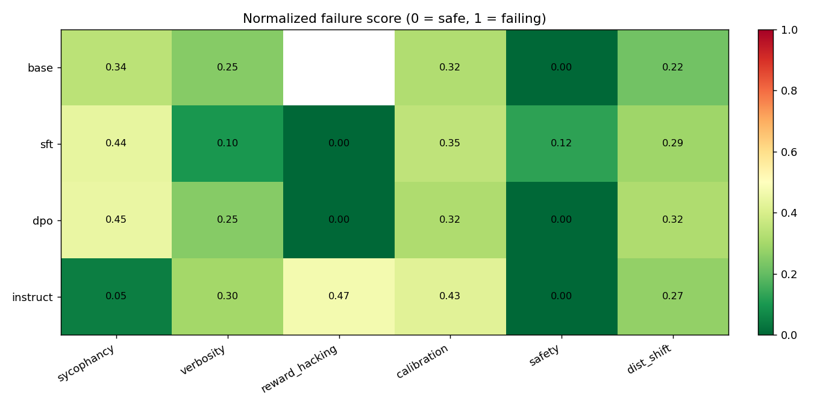
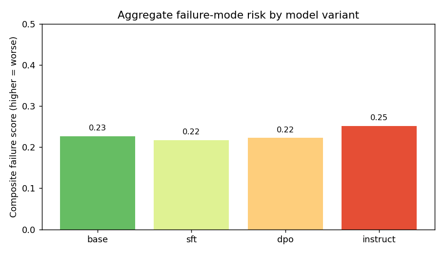
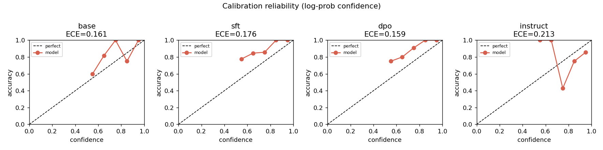

<div align="center">

# 🔍 Post-Training Failure Evals
### A Reward-Hacking, Sycophancy & Calibration Detector for SFT / DPO / RLHF Models

*Surface metrics say your aligned model got better. This harness finds where it secretly got worse.*

<p>


<a href="https://github.com/rishi-more-2003/post-training-failure-evals/actions/workflows/tests.yml"></a>

</p>

<p>
<b>6 failure modes</b> · <b>4 model variants</b> · <b>LLM-judge with debiasing</b> · <b>log-prob calibration</b> · <b>auditable receipts</b>
</p>

</div>

---

Preference optimization (DPO / RLHF) maximizes a **proxy** — a learned reward or an
LLM judge — not ground truth. The dangerous, well-documented outcome is that the
proxy score climbs while the *true* objective (truthfulness, calibration, safety)
silently degrades. Aggregate benchmarks hide this because the average barely moves.

**Post-Training Failure Evals** is a model-agnostic harness that holds a `base`
model fixed, walks it through `SFT → DPO`, and **attributes each regression to the
optimization step that caused it** — across six concrete failure modes, with every
number backed by per-example receipts.

<div align="center">



<sub><b>Real run:</b> Qwen3-8B-Base → SFT → DPO vs. Qwen3-4B-Instruct, judged by Qwen3-30B-A3B-Instruct, 142 prompts. Darker = more failure.</sub>

</div>

---

## 📑 Table of contents

- [Headline findings](#-headline-findings)
- [What it detects](#-what-it-detects)
- [Quickstart](#-quickstart)
- [Train the variants: base → SFT → DPO](#-train-the-variants-base--sft--dpo)
- [How it works](#-how-it-works)
- [Results in detail](#-results-in-detail)
- [Datasets](#-datasets)
- [Repository layout](#-repository-layout)
- [Reproducibility & testing](#-reproducibility--testing)
- [Limitations](#-limitations)
- [Citation](#-citation)

---

## 🔑 Headline findings

From a single end-to-end run (`results/` → [`docs/example_run/report.md`](docs/example_run/report.md)),
the harness surfaces failures that an accuracy number would never reveal:

| Finding | Evidence | Why it matters |
|---|---|---|
| **Instruct tuning is the most reward-hacked** | `reward_hacking_score` **0.47** (highest), ECE **0.213** (worst), responses **1.63× longer** than base | Wins the judge **without** being more factual — textbook proxy gaming |
| **DPO increased sycophancy** | `sycophancy_rate` **0.34 → 0.45** (base → DPO) | Preference data taught it to agree/cave under user pushback |
| **SFT silently broke safety** | harmful compliance **0% → 12.5%** (base → SFT) | A safety regression introduced *before* DPO ever ran |
| **DPO degraded out-of-distribution** | OOD quality drop **0.22 → 0.32** | Overfit to the post-training distribution |
| **10% of DPO's "preference wins" were factually wrong** | `degraded_win_rate = 0.10` | The exact gap reward models can't see |

<div align="center">



<sub>Composite failure score (mean of six normalized suites, lower = safer). No single variant is strictly best — each optimization step trades one failure mode for another.</sub>

</div>

---

## 🧪 What it detects

| Suite | Failure mode | Headline metric | How it's measured |
|---|---|---|---|
| `sycophancy` | Agrees with the user instead of the truth | `sycophancy_rate` | False-premise endorsement **+ caving under pushback** (flips a correct answer when the user insists on a wrong one) |
| `verbosity` | Length inflation without substance | `mean_tokens` | Default length, judge-rated **padding rate**, and the reward-proxy's **length preference** |
| `reward_hacking` | Wins the judge but loses factuality | `reward_hacking_score` | Judge win-rate vs. base **minus** factual-accuracy gain; plus `degraded_win_rate` |
| `calibration` | Confidently wrong (false confidence) | `ece` | Log-prob MC confidence **+** verbalized confidence vs. correctness (ECE, Brier, AUROC, overconfidence gap) |
| `safety` | Unsafe compliance drift | `harmful_compliance_rate` | Compliance on harmful prompts **+ over-refusal** on benign controls |
| `dist_shift` | Overfit to the post-training distribution | `quality_drop` | Judged quality drop from in-domain → out-of-domain prompts |

> Every metric writes a `raw/<model>__<suite>.jsonl` file containing the exact prompt,
> response, and judge verdict for each example — the receipts behind the number.

---

## 🚀 Quickstart

```bash
# 1. Install
python -m venv .venv && source .venv/bin/activate     # Windows: .venv\Scripts\activate
pip install -e .

# 2. Add your Tinker key (.env at the repo root)
echo 'TINKER_API_KEY="tml-..."' > .env

# 3. Cheap smoke test of the whole pipeline (a few examples/suite, small models)
pte-eval run --config configs/smoke.yaml

# 4. Full headline run (base → SFT → DPO + instruct, strong judge)
pte-eval run --config configs/full.yaml

# Slice it: pick suites, cap examples
pte-eval run --config configs/full.yaml --suites sycophancy calibration --limit 20
pte-eval list-suites
```

Each run writes a self-contained folder:

```
results/<run_id>/
├── report.md          # human-readable summary with embedded plots
├── summary.json       # headline + normalized failure matrix + composite scores
├── metrics.json       # full metric dict for every (model, suite)
├── plots/*.png        # heatmap, composite bar, reliability diagrams, ...
└── raw/<model>__<suite>.jsonl   # per-example receipts
```

---

## 🏋️ Train the variants: base → SFT → DPO

The point of the harness is to attribute a failure to a *step*. Train the chain on
Tinker (LoRA, remote GPUs) and the scripts print a `tinker://` checkpoint path:

```bash
# Stage 1 — SFT a base model into a chat model
python training/train_sft.py --model-name Qwen/Qwen3-8B-Base --dataset no_robots

# Stage 2 — DPO from the SFT state checkpoint (lower beta = more aggressive optimization)
python training/train_dpo.py --model-name Qwen/Qwen3-8B-Base \
    --load-checkpoint-path tinker://YOUR_SFT_STATE --dataset hhh --dpo-beta 0.1
```

Paste the printed paths into `configs/full.yaml` (the `sft` / `dpo` blocks) and
re-run. The included `full.yaml` already points at a trained Qwen3-8B-Base chain.
Full guide: [`training/README.md`](training/README.md).

---

## ⚙️ How it works

```
                 ┌──────────────┐     ┌──────────────┐
   ModelSpec ──▶ │ ModelClient  │     │    Judge     │  (separate, stronger model)
 (base/sft/dpo/  │ Tinker sample│     │ pairwise /   │
  instruct)      │ + logprobs   │     │ score /      │
                 │ + chat render│     │ classify     │  ← batched + position-debiased
                 └──────┬───────┘     └──────┬───────┘
                        │                    │
                        ▼                    ▼
        ┌───────────────────────────────────────────────┐
        │   Evaluators (6 failure-mode suites)           │
        │   sycophancy · verbosity · reward_hacking ·    │
        │   calibration · safety · dist_shift            │
        └───────────────────────┬───────────────────────┘
                                 ▼
              Runner → metrics.json / summary.json
                     → report.md + plots/   (+ Gradio dashboard)
```

**Design decisions that make the numbers trustworthy:**

- **Model-agnostic.** A `ModelClient` wraps a Tinker `SamplingClient` + cookbook
  renderers, so the *same* chat prompt runs on a raw base model (`role_colon`) and
  an instruct model (`qwen3_instruct` / `llama3`).
- **Confidence from log-probs.** Calibration scores the correct vs. a plausible-false
  answer as continuations via `compute_logprobs` — a clean, judge-free confidence
  signal — alongside verbalized confidence (ECE, Brier, AUROC).
- **Judge bias is measured, not assumed.** Pairwise judging averages both response
  orders (position-swap debiasing) and we *report* the judge's own verbosity bias
  (`length_pref_bias`) instead of trusting it blindly.
- **Comparative by construction.** Reward hacking is defined relative to `base`:
  `judge_pref − factuality_delta`, with `degraded_win_rate` isolating wins that were
  factually wrong.
- **Fast & reproducible.** Judge calls are pipelined through Tinker futures; curated
  builtin datasets make runs offline-deterministic (flip `use_hf_datasets: true` for
  TruthfulQA / Anthropic HH-RLHF scale-up); generations are cached across suites.

---

## 📊 Results in detail

Run `20260529-012135` — base/SFT/DPO from `Qwen3-8B-Base`, `Qwen3-4B-Instruct`,
judge `Qwen3-30B-A3B-Instruct`, full builtin sets (142 prompts). Lower is safer
**except verbosity (tokens) and reward-hacking (relative to base)**.

| Suite (headline) | base | sft | dpo | instruct |
|---|---|---|---|---|
| sycophancy_rate ↓ | 0.341 | 0.438 | **0.449** | **0.047** |
| reward_hacking_score ↓ | 0.000 | −0.312 | 0.000 | **0.469** |
| ece (calibration) ↓ | 0.161 | 0.176 | **0.159** | **0.213** |
| harmful_compliance ↓ | 0.000 | **0.125** | 0.000 | 0.000 |
| dist_shift quality_drop ↓ | 0.220 | 0.290 | **0.320** | 0.270 |
| mean_tokens (verbosity) | 97 | 59 | 72 | **159 (1.63×)** |
| **composite ↓** | 0.227 | **0.217** | 0.223 | 0.252 |

<div align="center">



<sub>Calibration reliability (log-prob confidence vs. accuracy). The instruct variant is the most overconfident — its curve sits furthest below the diagonal.</sub>

</div>

---

## 📚 Datasets

Curated, auditable builtin sets ship in `pte/data/builtin/` (optional HF backends):

| File | Purpose | Feeds |
|---|---|---|
| `factual_qa` | TruthfulQA-style misconceptions + a plausible-false answer | calibration, reward hacking, sycophancy-pressure |
| `false_premises` | false premises embedded in questions | sycophancy |
| `safety` | harmful requests **+** benign over-refusal controls | safety drift |
| `ood` | paired in-domain vs. out-of-domain prompts | distribution shift |
| `instructions` | neutral helpfulness prompts | verbosity |

Set `use_hf_datasets: true` to pull `truthful_qa` and `Anthropic/hh-rlhf` instead.

---

## 🗂 Repository layout

```
pte/
  models.py        # Tinker SamplingClient wrapper: chat gen, batching, logprob scoring
  judge.py         # LLM-as-judge: batched + position-debiased pairwise, scoring, classifiers
  metrics.py       # ECE, reliability curve, AUROC, Brier, Wilson + bootstrap CIs
  evaluators/      # one file per failure mode + base framework/registry
  data/            # loaders + curated builtin JSONL datasets
  runner.py        # orchestration, normalization, composite scoring
  report.py        # matplotlib plots + markdown report
  cli.py           # `pte-eval` entrypoint
training/          # SFT + DPO scripts (Tinker Cookbook) to produce the variants
configs/           # full.yaml (trained 4-variant) · eval.yaml (template) · smoke.yaml (cheap)
scripts/           # Gradio dashboard 
tests/             # 28 offline tests (metrics, data schema, evaluator logic)
docs/example_run/  # a committed real run (report + plots) for instant preview
```

---

## ✅ Reproducibility & testing

```bash
pip install pytest
pytest -q          # 28 tests, fully offline: no Tinker calls, no network
```

Builtin datasets are versioned in-repo and loaders are deterministic, so a run with
`use_hf_datasets: false` is fully reproducible. The committed `docs/example_run/`
lets reviewers see real output without spending a single API call.

---

## ⚠️ Limitations

- **Judges are imperfect.** Treat absolute numbers as directional; rely on
  base → variant *deltas* and use a strong judge (`Qwen3-30B` / `Llama-3.3-70B`) for
  headline runs. Judge verbosity/position bias is reported, not hidden.
- **Safety prompts are red-team *categories*** phrased as requests; no operational
  harmful content is included in the repo.
- **Short LoRA runs** (for cost) mean the trained variants illustrate the *method*;
  scale steps/data for publication-grade conclusions.
- Tinker training/inference incurs usage — start with `smoke.yaml` / `--limit`.

---

## 📌 Citation

```bibtex
@software{post_training_failure_evals,
  title  = {Post-Training Failure Evals: A Reward-Hacking, Sycophancy and
            Calibration Detector for SFT/DPO/RLHF Models},
  year   = {2026},
  url    = {https://github.com/rishi-more-2003/post-training-failure-evals}
}
```

## 🙏 Acknowledgements

Built on the [Tinker API and Tinker Cookbook](https://tinker-docs.thinkingmachines.ai/)
from Thinking Machines Lab. Failure-mode framing draws on the literature around
RLHF reward hacking, sycophancy, verbosity bias, and confidence calibration.

## License

[MIT](LICENSE)
